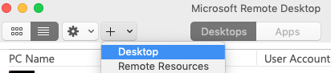
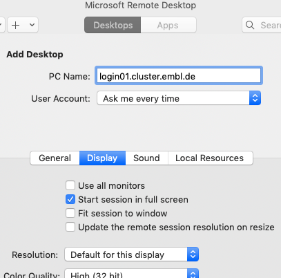
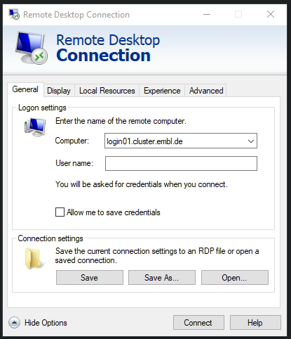
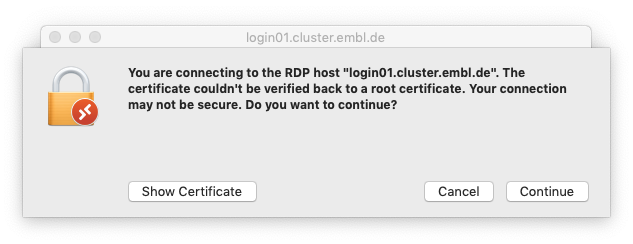
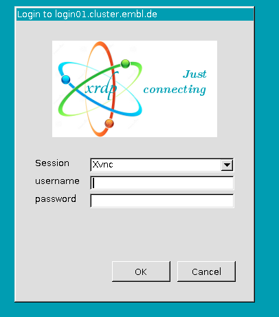
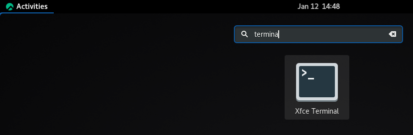
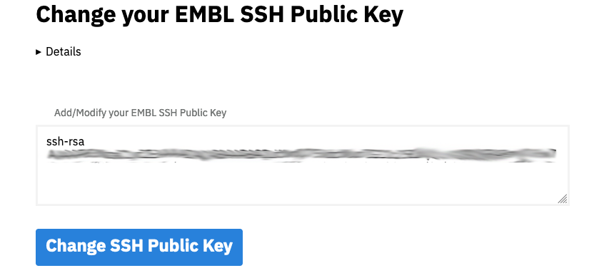
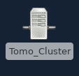
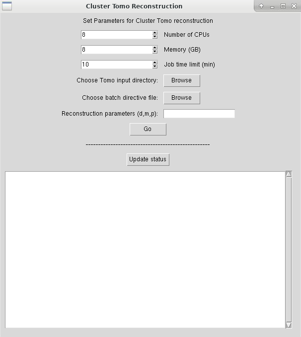
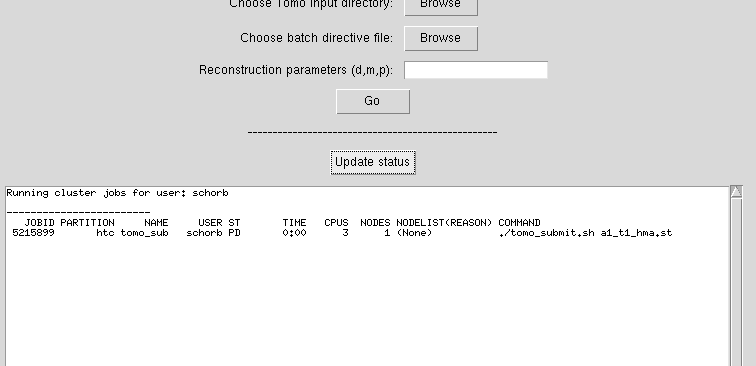

# Reconstructing Tomograms with IMOD batch on the EMBL Cluster

This tutorial explains how to reconstruct tomograms on the EMBL cluster.

It makes use of the graphical login procedure for the EMBL cluster, described [here](https://wiki.embl.de/cluster/Env).


## Setting up the remote Desktop

The connection to a graphical login node of the EMBL cluster uses RDP (https://en.wikipedia.org/wiki/Remote_Desktop_Protocol).

This is the built-in remote control in Microsoft Windows.

In order to use the connection from a Mac you need to install the client software from https://apps.apple.com/app/microsoft-remote-desktop/id1295203466?mt=12 .

If you have trouble with the App store, try downloading it from https://www.macupdate.com/app/mac/8431/microsoft-remote-desktop/old-versions .

***

### MacOS 

To initially set up the connection, click the plus logo to add a new PC ("Desktop" in older versions).



Provide the address `login01.cluster.embl.de` and optionally choose your desired display settings for the connection.



### Windows
Open the software **Remote Desktop Connection**. Provide the address `login01.cluster.embl.de` and optionally choose your desired display settings for the connection.




***

Once you have set up the connection, you can just launch it by double-clicking its entry in the list of the Remote Desktop main window. You can ignore the certificate warning that might show up.



Provide your EMBL login and password in the login window. 



At the moment there is no desktop loaded automatically. To start the desktop, click "Activities" in the top left corner.



Type `terminal` in the search box and launch the "Xfce Terminal program".
This will start a terminal session. In there type 

```
cp -r /g/emcf/schorb/code/admin_scripts/autostart ~/.config/ | xfdesktop
```

and hit enter to launch the desktop. Keep this terminal window open for the duration of this session.

## Initial setup

If you are launching jobs on the cluster for the very first time, a couple of steps need to be done to set you up for processing on a cluster.
You need to generate and deploy secure keys to allow your tasks to be run on multiple machines without the need of providing your password for login every time.

Open a terminal by right-clicking in an empty area of the desktop and selecting `Open Terminal here`.
Then copy and paste this command and execute it by pressing `Return`.
```
[ -d ~/.ssh ] || mkdir ~/.ssh
[ -f ~/.ssh/id_rsa ] || ssh-keygen -t rsa -b 4096 -q -N ""
```

This will generate the keys.

You now also need to copy your public key that you can display here:

```
cat ~/.ssh/id_rsa.pub
```

Be careful **not** to use `CTRL + C` for copying text as this key combination will terminate the procedure!
Paste that key into the box on this website.

https://pwtools.embl.de/sshkey



Now you are set!

## Launching The batch reconstructions


You should find an icon called `Tomo_Cluster` on your desktop.



If you don't (some more recent EMBL users might need that), open a terminal by right-clicking in an empty area of the desktop and selecting `Open Terminal here`.
Then copy and paste this command and execute it by pressing `Return`.

```
cp /g/emcf/schorb/code/admin_scripts/Tomo_Cluster_GUI.desktop ~/Desktop
```

Now, the desktop icon should be there.

When you click the icon the following window appears:



Here, you can control the resources you like to request for the individual reconstruction cluster processing job. Be aware that your jobs will be terminated after the time limit you specify here, even when it is still running a computation. For dual axis reconstruction, some more time is needed. Also, the more resources (and the longer), your priority in getting them assigned will be lowered and you might have to wait some time until the reconstructions can start. It is not recommended to request more than 16 CPUs for a job.

You then need to browse to the source directory that hosts all your tilt series (called `.st`). And you need to specify a batchdirective file in `ADOC` format.

If desired, you can also give additional parameters to request specific processing steps like patch area cleaning (`p`), montage stitching (`m`) or dual axis reconstruction (`d`).

Also, there is the experimental option `fl` that will try to run a flattening process on the final reconstruction.

If you intend to test some parameters, or if you have problems with the automatic reconstruction, consider adding `a` to the parameters. This will output all intermediate files from the reconstruction to a new subdirectory. Be aware that this can create a lot of data when reconstructing many tomograms in parallel (~ 10GB per tomo).


Once you click `Go`, the resources will be requested from the cluster and once a free slot is found, the reconstructions will launch. At the same time there will be a small window that reminds you of the remaining run time of the job.

## Checking the status of running cluster jobs

By clicking the `Update Status` button, you will be presented with a list of all your running cluster jobs.



You can also get this information when you re-open the GUI window without launching any additional reconstruction jobs.


## Happy reconstruction!
